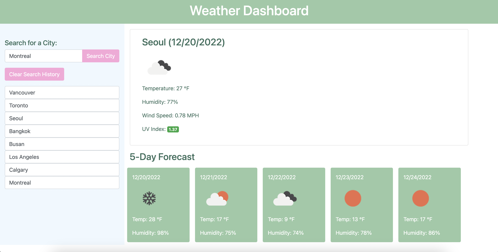

# Weather Dashboard

## Table of Contents

-   [Description](#description)
-   [Technologies used](#technologies-used)
-   [Links](#links)

## Description

The Weather Dashboard works by allowing the user to input a city name (for example, Vancouver, Los Angeles) in plain English. It will then conver the city name into lat(latitude) and lon(longitude) and pull the required data from the Open Weather public API. It will then update the data with the current weather data as well as the 5 day forcast on the page. Some of the elements change base on the current weather, for example the 5 day icons change depending on the current weather. Once they have checked their city name they can then check another or come back at a later time to find their most recent city name saved in localstorage and shown on screen.

## Technologies used

This app was built with HTML, CSS to polish it up and Javascript. We pulled from the Open Weather API for the weather data.

## Links

https://vchan852.github.io/weather-dashboard/

https://github.com/vchan852/weather-dashboard

## Application Preview

